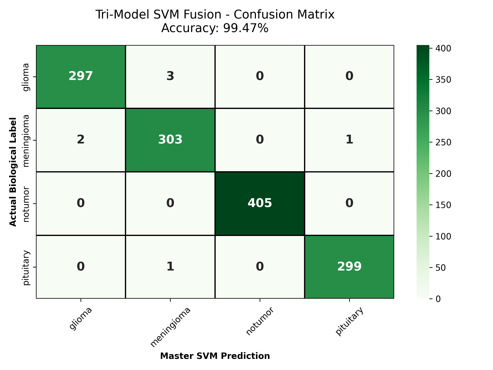
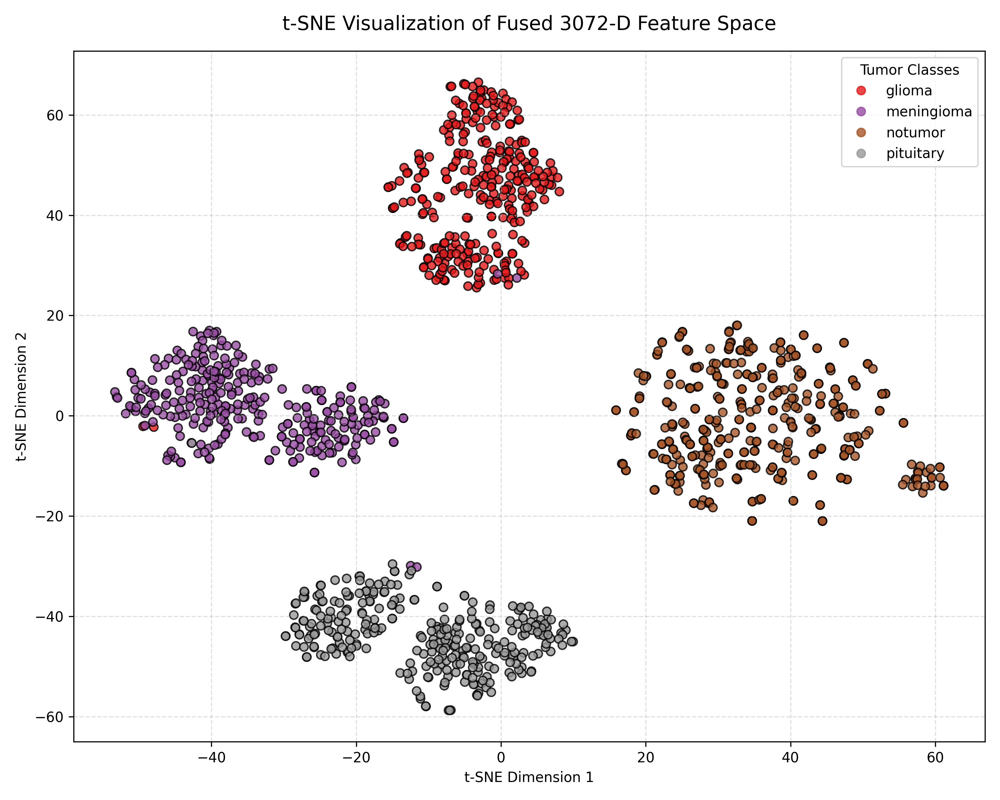
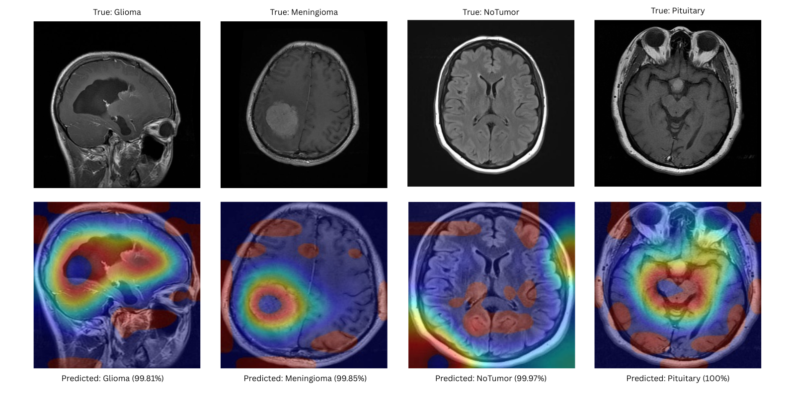

# Encephlo 🧠

**Tri-Model Feature Fusion Architecture for Neuro-Oncological Classification**

The deployment of deep learning in neuro-oncology is frequently bottlenecked by "shortcut learning"—where standard neural networks memorize background artifacts (like skull boundaries or watermarks) rather than analyzing actual biological pathology.

Encephlo is an architectural solution to this dataset bias. By decapitating standard classification layers and mathematically fusing dense local textures, spatial gradients, and global structural dependencies, this pipeline achieves **99.47% accuracy** with **zero false negatives** across four biological classes (Glioma, Meningioma, Pituitary Adenoma, and Healthy Tissue).

---

## ⚡ The Diagnostic Pipeline

The Encephlo architecture is structured into three mathematically rigid phases to ensure absolute diagnostic stability:

### 1. Anatomical Pre-Processing (OpenCV)

To definitively prevent shortcut learning prior to inference, an aggressive OpenCV contouring algorithm auto-crops the MRI, completely masking the skull and non-anatomical voids. Contrast Limited Adaptive Histogram Equalization (CLAHE) is then applied to hyper-pronounce soft tissue boundaries.

### 2. Tri-Model Feature Extraction

The cleaned tensors are processed in parallel through three orthogonal computer vision paradigms. The final classification layers are removed to output raw mathematical feature arrays:

- **DenseNet121 (1024-D):** Isolates dense cellular textures and localized micro-anomalies.
- **EfficientNet-B0 (1280-D):** Captures multi-scale spatial gradients and macroscopic tumor edges.
- **ViT-B/16 (768-D):** A Vision Transformer utilizing self-attention to map long-range structural dependencies and global anatomical geometry.

### 3. Master SVM Fusion

The three arrays are horizontally concatenated into a singular, highly dense **3072-Dimensional feature vector**. Rather than relying on softmax probabilities, this tensor is evaluated by a Support Vector Machine (SVM) utilizing a Radial Basis Function (RBF) kernel, translating deep learning features into rigid mathematical decision boundaries.

---

## 📊 Mathematical Separation & Performance

In a clinical setting, a false negative is the most catastrophic failure mode. The Tri-Model SVM Fusion completely eliminates the spatial blind spots of the isolated models, achieving a perfect 405/405 classification rate for healthy tissue (0 false negatives).

  

To visually prove the pipeline is not executing probabilistic guesswork, t-SNE dimensionality reduction was applied to the 3072-D extracted feature space. The vectors naturally gravitate into four strictly isolated topological islands, proving the deep learning models learned defining biological geometries.

  

---

## 🔍 Explainable AI (XAI) Topological Dashboard

To bridge the gap between computational power and clinical transparency, Encephlo rejects standard, low-resolution Grad-CAM approximations. The pipeline directly extracts deep convolutional feature maps from EfficientNet's final spatial activations, projecting a high-fidelity thermal overlay onto the 3D clinical interface.

This mathematically proves the model's focal point targets the true biological tumor mass rather than environmental noise.

  

---

## 🛠️ Core Tech Stack

Encephlo is built on a high-performance Python ecosystem, leveraging GPU acceleration for heavy tensor extraction and mathematical fusion.

- **Deep Learning Framework:** PyTorch & Torchvision _(Model architecture, decapitation, and gradient hooking)_
- **Classical Machine Learning:** Scikit-Learn _(Master SVM with RBF kernel, t-SNE dimensionality reduction)_
- **Computer Vision:** OpenCV & Pillow _(Anatomical auto-cropping, CLAHE contrast enhancement, thermal heatmap blending)_
- **Scientific Computing:** NumPy _(High-dimensional vector concatenation and tensor normalization)_
- **Hardware Acceleration:** CUDA / NVIDIA Tesla GPU Framework

## 👥 Contributors

- **Aditya Sharma** ([@NyxLumen](https://github.com/NyxLumen))
- **Siddharth Gupta**
- **Abel Bobby**

_Made with love_
